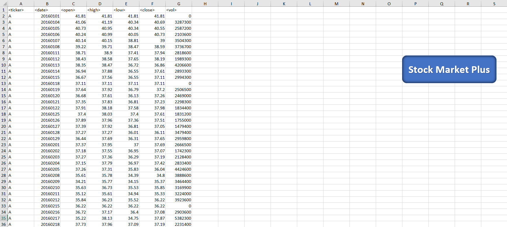
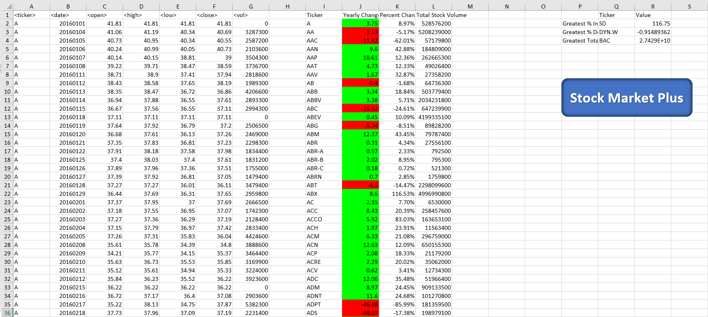

# VBA Wall Street Tracker

	
This VBA script loops through all the stocks for one year and output the following information before repeating this process on the next years (worksheets) data:

* The ticker symbol.

* Yearly change from opening price at the beginning of a given year to the closing price at the end of that year.

* The percent change from opening price at the beginning of a given year to the closing price at the end of that year.

* The total stock volume of the stock.

* The stock with the "Greatest % increase", "Greatest % decrease" and "Greatest total volume".

### Tech Stack
* Miscrosoft Excel with Macros Enabled

### User Instructions
* Clone the repository: git clone https://github.com/DarrylB32/VBA-Stock_Market_Tracker.git

* Open [StockMarketPlus.xlsm](StockMarketPlus.xlsm) file.
	

* Select the blue "Stock Market Plus" icon.
	

### Additional Notes
Depending on the specs of your computer, this script may take several minutes to run. Ideally, this should take approximately 5-7 minutes but currently it takes longer. Changes to the script are being made to increase the script processing speed. 
